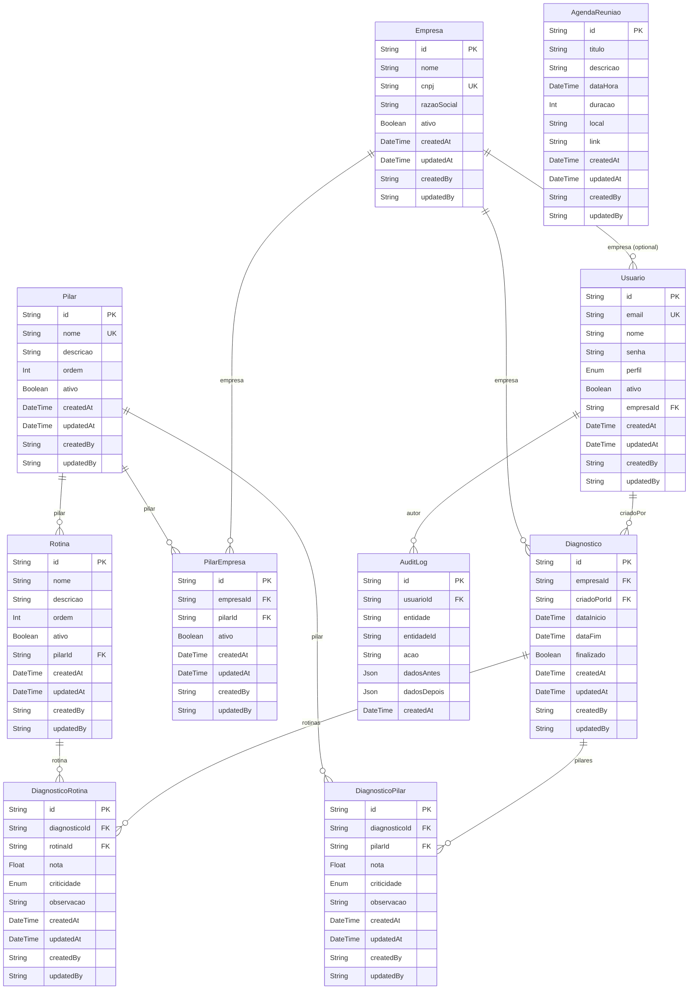

# Reiche Academy - Data Model (ERD)

This document summarizes the Phase 1 data model and relationships implemented in `backend/prisma/schema.prisma`.

## ER Diagram (Mermaid)

## Enums
- `PerfilUsuario`: CONSULTOR | GESTOR | COLABORADOR | LEITURA
- `Criticidade`: ALTO | MEDIO | BAIXO
- `StatusAcao`: PENDENTE | EM_ANDAMENTO | CONCLUIDA | CANCELADA

## Unique Constraints & Indexes
- `Usuario.email` unique
- `Empresa.cnpj` unique
- `Pilar.nome` unique
- `PilarEmpresa (empresaId, pilarId)` unique (vínculo único por empresa+pilar)
- `DiagnosticoPilar (diagnosticoId, pilarId)` unique
- `DiagnosticoRotina (diagnosticoId, rotinaId)` unique
- `AuditLog`: indexes on `(entidade, entidadeId)` and `(usuarioId)`

## Cardinalities & Notes
- Empresa 1—N Usuario (empresaId opcional em Usuario)
- Empresa 1—N Diagnostico (cada diagnóstico pertence a uma empresa)
- Usuario 1—N Diagnostico (criadoPorId)
- Pilar 1—N Rotina
- Empresa N—N Pilar via `PilarEmpresa`
- Diagnostico N—N Pilar via `DiagnosticoPilar` (com nota e criticidade)
- Diagnostico N—N Rotina via `DiagnosticoRotina` (com nota e criticidade)
- Usuario 1—N AuditLog

## Audit & Soft Delete
- Soft delete: `ativo` em Usuario, Empresa, Pilar, Rotina
- Auditoria: `createdBy`, `updatedBy`, timestamps

## Business Rules Reflected
- Isolamento por empresa: relações sempre filtráveis por `empresaId`
- Criticidade enum sem acentos: `ALTO|MEDIO|BAIXO`
- Validações de unicidade para nomes/CNPJ e vínculos
- Proteção de exclusão lógica (ex.: Pilar não desativado se houver Rotinas ativas)

## Suggested Validations/Checks
- Foreign keys enforced via Prisma (references)
- Migrations confirm constraints exist
- Seed minimal data for `Pilar` and `Rotina` to validate joins
- Sample query: listar pilares e rotinas por empresa via `PilarEmpresa`
