# Handoffs — Estrutura de Comunicação Entre Agentes

Este diretório contém **handoffs** — documentos que passam contexto e decisões entre agentes do fluxo de desenvolvimento.

---

## Estrutura

```
/docs/handoffs/
  ├── <feature-name>/
  │   ├── reviewer-v1.md       (opcional - se houver revisão prévia)
  │   ├── dev-v1.md           (primeira implementação)
  │   ├── pattern-v1.md       (validação de padrões)
  │   ├── dev-v2.md           (correções, se pattern-v1 = NÃO CONFORME)
  │   ├── pattern-v2.md       (revalidação)
  │   ├── qa-unit-v2.md       (testes unitários, se pattern-v2 = CONFORME)
  │   └── qa-e2e-v2.md        (testes E2E finais)
  └── README.md               (este arquivo)
```

---

## Nomenclatura

```
<agente>-v<versão>.md

Agentes:
- system-engineer (System Engineer - meta-nível, arquitetura)
- reviewer        (Business Rules Reviewer)
- dev             (Dev Agent)
- pattern         (Pattern Enforcer)
- qa-unit         (QA Unitário Estrito)
- qa-e2e          (QA E2E Interface)

Versão:
- v1, v2, v3... (incrementa apenas em idas e vindas)
```

---

## Tipos de Handoffs

### Handoffs Regulares (Dev → Pattern → QA)
Fluxo padrão de implementação de features:
```
<feature-name>/
  ├── reviewer-v1.md       (opcional - se houver revisão prévia)
  ├── dev-v1.md           (primeira implementação)
  ├── pattern-v1.md       (validação de padrões)
  ├── dev-v2.md           (correções, se pattern-v1 = NÃO CONFORME)
  ├── pattern-v2.md       (revalidação)
  ├── qa-unit-v2.md       (testes unitários, se pattern-v2 = CONFORME)
  └── qa-e2e-v2.md        (testes E2E finais)
```

### Handoffs de System Engineer (Meta-Nível)
Mudanças arquiteturais, novos módulos, governança:
```
<feature-name>/
  ├── system-engineer-v1.md           (especificação + instruções para Dev)
  ├── SYSTEM_ENGINEERING_CHANGE_REPORT.md  (relatório de impacto)
  └── README.md                       (navegação do handoff)
```

**Diferenças:**
- System Engineer **não entra no fluxo regular** (Pattern → QA)
- Handoff é **ponto de entrada** para Dev Agent iniciar implementação
- Após Dev implementar, **fluxo regular** continua (dev → pattern → qa)

---

## Regras de Versionamento

### Nova Feature
```
autenticacao-login/
  └── dev-v1.md
```

### Pattern Enforcer CONFORME
```
autenticacao-login/
  ├── dev-v1.md
  ├── pattern-v1.md      ✅ CONFORME
  └── qa-unit-v1.md      (mesma versão)
```

### Pattern Enforcer NÃO CONFORME
```
autenticacao-login/
  ├── dev-v1.md
  ├── pattern-v1.md      ❌ NÃO CONFORME
  ├── dev-v2.md          (correções - incrementa versão)
  └── pattern-v2.md      (revalidação)
```

### Fluxo Completo Aprovado
```
autenticacao-login/
  ├── dev-v2.md          (após correções)
  ├── pattern-v2.md      ✅ CONFORME
  ├── qa-unit-v2.md      ✅ Testes OK
  └── qa-e2e-v2.md       ✅ Fluxo OK
```

---

## Fluxo de Agentes

```mermaid
graph LR
    A[Reviewer] -->|opcional| B[Dev v1]
    B --> C[Pattern v1]
    C -->|CONFORME| D[QA Unit v1]
    C -->|NÃO CONFORME| E[Dev v2]
    E --> F[Pattern v2]
    F -->|CONFORME| G[QA Unit v2]
    G --> H[QA E2E v2]
```



---

## Quando Incrementar Versão?

| Situação | Ação | Exemplo |
|----------|------|---------|
| Nova feature | Criar v1 | `dev-v1.md` |
| Pattern CONFORME | Mesma versão | `pattern-v1.md`, `qa-unit-v1.md` |
| Pattern NÃO CONFORME | Incrementar | `dev-v2.md` |
| QA falhou | Incrementar | `dev-v3.md` |

---

## Responsabilidades por Agente

### System Engineer (Meta-Nível)
- **Cria:** `system-engineer-v1.md`, `SYSTEM_ENGINEERING_CHANGE_REPORT.md`, ADRs
- **Lê:** FLOW.md, DOCUMENTATION_AUTHORITY.md, definições de agentes
- **Atua quando:** Nova feature arquitetural, mudança de governança, criação/modificação de agentes
- **Não atua:** Em PRs de código, implementação regular

### Reviewer
- **Cria:** `reviewer-v1.md` (sempre v1, apenas análise inicial)
- **Lê:** `/docs/business-rules/*`
- **Bloqueia:** se houver regras ausentes críticas

### Dev Agent
- **Cria:** `dev-v<N>.md`
- **Lê:** 
  - `reviewer-v1.md` (se houver)
  - `pattern-v<N-1>.md` (se for correção)
- **Incrementa versão:** quando Pattern retornar NÃO CONFORME

### Pattern Enforcer
- **Cria:** `pattern-v<N>.md`
- **Lê:** `dev-v<N>.md` (mesma versão)
- **Bloqueia:** se houver violações críticas de padrão

### QA Unitário
- **Cria:** `qa-unit-v<N>.md`
- **Lê:** 
  - `pattern-v<N>.md` (deve ser CONFORME)
  - `/docs/business-rules/*`
- **Só atua:** se Pattern = CONFORME

### QA E2E
- **Cria:** `qa-e2e-v<N>.md`
- **Lê:** 
  - `qa-unit-v<N>.md` (testes unitários OK)
  - `pattern-v<N>.md`
- **Só atua:** se QA Unit passou

---

## Exemplo Real: Login com 1 Ida e Volta

```
/docs/handoffs/autenticacao-login/

Tentativa 1 (BLOQUEADA):
├── dev-v1.md          (implementação inicial)
└── pattern-v1.md      ❌ NÃO CONFORME
                          Violações:
                          - Naming conventions
                          - Estrutura de pastas

Correção (APROVADA):
├── dev-v2.md          (correções aplicadas)
├── pattern-v2.md      ✅ CONFORME
├── qa-unit-v2.md      ✅ Testes passaram
└── qa-e2e-v2.md       ✅ Fluxo validado
```

**Visualmente óbvio:**
- v1 bloqueou no Pattern Enforcer
- v2 passou por todo o fluxo
- Última versão (v2) é a atual

---

## Navegação Rápida

### Ver última versão de uma feature
```bash
ls autenticacao-login/ | sort -V | tail -n 4
```

### Verificar se feature está aprovada
```bash
# Se existir qa-e2e-vN.md → feature completa
ls autenticacao-login/qa-e2e-*.md
```

### Identificar bloqueios
```bash
# Se existir pattern-vN.md mas não qa-unit-vN.md → bloqueado
ls autenticacao-login/
```

---

## Limpeza e Retenção

### Quando arquivar?
- Feature mergeada em produção
- Após 90 dias sem atividade

### Como arquivar?
```bash
# Mover para /docs/handoffs-archive/
mv /docs/handoffs/feature-antiga/ /docs/handoffs-archive/
```

### Manter sempre
- Última versão aprovada de cada feature ativa
- Handoffs de features em produção

---

## Convenções de Escrita

### Títulos
```md
# Dev Handoff: Autenticação - Login (v2)
```

### Status no início
```md
**Status:** ✅ CONFORME | ❌ NÃO CONFORME | ⚠️ PARCIAL
```

### Referências
```md
**Handoff anterior:** [dev-v1.md](./dev-v1.md)
**Próximo passo:** Pattern Enforcer
```

---

**Estrutura mantida pelo System Engineer**  
**Última atualização:** 2026-01-15

---

## Features Ativas

### Cockpit de Pilares (Fase 1 - MVP)
📂 [cockpit-pilares/](./cockpit-pilares/)  
**Status:** 🟢 READY FOR IMPLEMENTATION  
**Handoff:** [system-engineer-v1.md](./cockpit-pilares/system-engineer-v1.md)  
**ADR:** [ADR-003](../adr/ADR-003-cockpit-pilares-architecture.md)  
**Próximo agente:** Dev Agent
