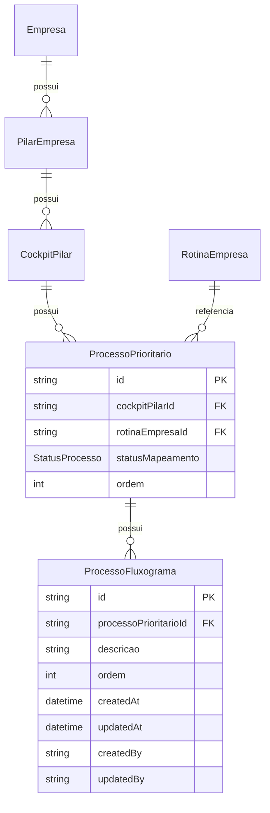

# Business Analysis: Fluxograma de Processos Prioritários

**Data:** 2026-01-27  
**Analista:** Business Analyst  
**Regras Documentadas:** [`/docs/business-rules/processo-fluxograma.md`](../../business-rules/processo-fluxograma.md)

---

## 1️⃣ Resumo da Análise

- **Modo:** Proposta (nova feature)
- **Regras documentadas:** 1 arquivo criado
- **Status:** ✅ **APROVADO**

**Feature:** Sistema de fluxograma para processos prioritários no Cockpit de Pilares, permitindo documentar ações/passos de cada processo através de uma lista ordenada e editável.

**Impacto:**
- **Backend:** Nova entidade `ProcessoFluxograma`, novos endpoints CRUD
- **Frontend:** Novo drawer (baseado em rotina-edit-drawer), ícone indicador, drag & drop
- **Banco:** Nova tabela `processos_fluxograma`, relação com `ProcessoPrioritario`

---

## 2️⃣ Regras Documentadas

### Regras Propostas
- **[processo-fluxograma.md](../../business-rules/processo-fluxograma.md)** - Regra completa de criação, edição, remoção e reordenação de ações do fluxograma de processos prioritários

**Destaques da regra:**
- Relação: `ProcessoFluxograma → ProcessoPrioritario` (não com RotinaEmpresa)
- Validação: 10-300 caracteres por ação
- RBAC: GESTOR, ADMINISTRADOR, COLABORADOR (LEITURA só visualiza)
- Exclusão: Hard delete (permanente)
- Ordenação: Auto-incrementada + drag & drop
- Status manual: `statusMapeamento` independente do fluxograma
- Auditoria: Todas operações (criar, editar, remover, reordenar, alterar status)

---

## 3️⃣ Análise de Completude

### ✅ O que está claro

**Modelo de Dados:**
- [x] Estrutura Prisma definida (`ProcessoFluxograma`)
- [x] Relação com `ProcessoPrioritario` clara
- [x] Campos obrigatórios especificados (`descricao`, `ordem`)
- [x] Índices de performance planejados
- [x] Cascade delete configurado

**Interface de Usuário:**
- [x] Localização no sistema definida (matriz-processos)
- [x] Drawer de referência indicado (rotina-edit-drawer)
- [x] Estados do ícone especificados (☆/★)
- [x] Funcionalidades CRUD detalhadas
- [x] Drag & drop para reordenação
- [x] Validações de input (min/max caracteres)

**Regras de Negócio:**
- [x] RBAC completo (3 perfis com acesso, 1 sem)
- [x] Multi-tenant (cadeia de validação documentada)
- [x] Validações (tamanho, obrigatoriedade)
- [x] Comportamento de ícone (baseado em count)
- [x] Independência entre fluxograma e statusMapeamento
- [x] Auditoria completa (6 eventos documentados)

**API:**
- [x] Endpoints sugeridos (5 rotas)
- [x] DTOs com validações (Create, Update, Reordenar)
- [x] Guards e decorators especificados
- [x] Exemplos de queries Prisma

**Cenários:**
- [x] Happy path documentado (3 cenários)
- [x] Casos de erro documentados (5 cenários)
- [x] Validações de edge cases (descrição curta/longa, permissões, multi-tenant)

---

### ⚠️ O que está ausente/ambíguo

**Decisões de UI (não bloqueantes - Dev Agent decide):**
1. **Campo statusMapeamento na interface:**
   - Onde exatamente aparece? (coluna da tabela, card, modal?)
   - Formato: dropdown, select, badges clicáveis?
   - **Sugestão documentada:** Dropdown inline na lista de processos

2. **Limite visual de ações:**
   - Mostrar warning quando > 50 ações?
   - Desabilitar botão "Adicionar" após limite?
   - **Observação:** Limite técnico é ilimitado, mas UX pode sugerir máximo

3. **Animações:**
   - Usar Angular Animations para feedback visual ao adicionar/remover?
   - Transições no drag & drop?
   - **Decisão Dev Agent:** Seguir padrão existente no sistema

4. **Modo de edição:**
   - Edição inline (textarea) como no drawer de referência?
   - Modal separado?
   - **Sugestão:** Seguir padrão do rotina-edit-drawer (inline)

**Observação:** Estes pontos são **decisões de implementação**, não bloqueadores. Dev Agent pode resolver baseado em padrões existentes.

---

### 🔴 Riscos Identificados

#### Segurança
- ✅ **RBAC documentado:** Apenas GESTOR, ADMINISTRADOR, COLABORADOR têm acesso de escrita
- ✅ **Multi-tenant garantido:** Cadeia de validação documentada (ProcessoFluxograma → ProcessoPrioritario → CockpitPilar → PilarEmpresa → empresaId)
- ✅ **Input validation:** Min/max caracteres, tipos de dados validados
- ⚠️ **XSS:** Descrições são texto puro - sanitização necessária no frontend/backend
  - **Recomendação:** Usar pipe `sanitize` ou `SafeHtml` no Angular
  - **Backend:** Validar/escapar caracteres especiais

#### RBAC
- ✅ **Guards aplicados:** `@Roles('ADMINISTRADOR', 'GESTOR', 'COLABORADOR')`
- ✅ **LEITURA bloqueado:** Sem acesso de escrita (apenas visualização)
- ⚠️ **COLABORADOR vs statusMapeamento:** 
  - COLABORADOR pode alterar `statusMapeamento`?
  - **Resposta:** SIM (confirmado pelo usuário)
  - Validar se faz sentido no contexto (colaborador pode marcar processo como CONCLUIDO?)

#### Multi-Tenant
- ✅ **Isolamento documentado:** Queries validam `empresaId` através da cadeia
- ✅ **Testes necessários:** QA deve validar tentativas de cross-tenant access
- ⚠️ **Performance:** Queries com múltiplos JOINs - indexação adequada?
  - **Mitigação:** Índices criados em `processoPrioritarioId`

#### LGPD
- ✅ **Auditoria completa:** Todos eventos geram AuditLog
- ✅ **Campos sensíveis:** Nenhum dado pessoal armazenado (apenas descrições de processos)
- ⚠️ **Retenção de dados:** AuditLog cresce indefinidamente?
  - **Observação:** Não bloqueante, mas considerar política de retenção futura

#### Performance
- ⚠️ **Limite ilimitado de ações:** Processos com 100+ ações podem degradar UX
  - **Mitigação documentada:** UI pode sugerir limite de 50, query usa `orderBy`
  - **Recomendação:** QA deve testar com 100+ ações
- ⚠️ **Reordenação em batch:** Atualizar múltiplas ordens em uma transação
  - **Sugestão:** Usar `prisma.$transaction()` para atomicidade
- ⚠️ **Drag & drop responsivo:** Testar em dispositivos móveis
  - **Observação:** CDK DragDrop suporta touch, mas validar UX

---

## 4️⃣ Checklist de Riscos Críticos

- [x] **RBAC documentado e aplicado?** SIM - Guards + validações por perfil
- [x] **Isolamento multi-tenant garantido?** SIM - Cadeia de validação documentada
- [x] **Auditoria de ações sensíveis?** SIM - 6 eventos mapeados
- [x] **Validações de input?** SIM - Min/max caracteres, tipos de dados
- [x] **Proteção contra OWASP Top 10?** PARCIAL - XSS precisa de sanitização explícita
- [x] **Dados sensíveis protegidos?** SIM - Nenhum dado pessoal armazenado

**Riscos Menores (não bloqueantes):**
- ⚠️ XSS em descrições (mitigação: sanitização)
- ⚠️ Performance com muitas ações (mitigação: limite sugerido + testes)
- ⚠️ COLABORADOR pode alterar status (decisão de negócio - validar com stakeholder)

---

## 5️⃣ Bloqueadores

**✅ Nenhum bloqueador identificado.**

Todos os requisitos críticos estão documentados:
- Modelo de dados completo
- Regras de negócio claras
- RBAC definido
- Multi-tenant garantido
- Validações especificadas
- Auditoria mapeada

**Pontos pendentes são decisões de implementação** (UI/UX), não bloqueadores de negócio.

---

## 6️⃣ Recomendações

**Não vinculantes - decisão humana/Dev Agent necessária:**

### Segurança
1. **Sanitização XSS:**
   - Frontend: Usar pipe `| safe` ou validação HTML no Angular
   - Backend: Escapar caracteres especiais em descrições (`<`, `>`, `&`, `"`, `'`)
   - **Prioridade:** ALTA

2. **Rate Limiting:**
   - Limitar criação de ações (ex: 10 por minuto por usuário)
   - Prevenir abuso/spam
   - **Prioridade:** MÉDIA

### UX/Performance
3. **Limite Visual:**
   - Mostrar badge de warning quando > 50 ações
   - Sugerir divisão em sub-processos
   - **Prioridade:** BAIXA

4. **Paginação/Virtual Scroll:**
   - Se processos tiverem > 50 ações, considerar virtual scroll (CDK)
   - Melhora performance de renderização
   - **Prioridade:** BAIXA (implementar se QA detectar lentidão)

5. **Confirmação em Reordenação:**
   - Salvar automaticamente (como no drawer de referência)
   - Ou adicionar botão "Salvar Ordem"?
   - **Sugestão:** Salvar automaticamente (melhor UX)

### Funcionalidade
6. **Duplicar Ação:**
   - Botão "Duplicar" para copiar ação existente
   - Útil para processos repetitivos
   - **Prioridade:** BAIXA (feature futura)

7. **Templates de Fluxograma:**
   - Criar biblioteca de fluxogramas padrão (ex: "Processo de Vendas")
   - Usuário pode importar template
   - **Prioridade:** BAIXA (feature futura)

8. **Exportar Fluxograma:**
   - Botão para exportar ações em PDF/Excel
   - Facilita compartilhamento
   - **Prioridade:** BAIXA (feature futura)

### Revisão de Negócio
9. **COLABORADOR e statusMapeamento:**
   - Validar com stakeholder se COLABORADOR deve poder marcar processo como CONCLUIDO
   - Ou apenas GESTOR/ADMINISTRADOR?
   - **Ação:** Confirmar regra de negócio antes de implementar

10. **Relação statusMapeamento ↔ Fluxograma:**
    - Atualmente independentes (correto)
    - Considerar adicionar sugestão automática futura:
      - "Processo tem 10 ações. Deseja marcar como EM_ANDAMENTO?"
    - **Prioridade:** BAIXA (não implementar agora)

---

## 7️⃣ Decisão e Próximos Passos

### ✅ **APROVADO**

**Justificativa:**
- Regras completas e testáveis
- Segurança adequada (RBAC + multi-tenant)
- Auditoria completa
- Validações bem definidas
- Riscos identificados e mitigados
- Nenhum bloqueador crítico

**Próximos Passos:**

- [x] **Prosseguir para: Dev Agent Enhanced**
- [x] **Dev Agent deve:**
  1. Criar migration Prisma para `ProcessoFluxograma`
  2. Adicionar relação em `ProcessoPrioritario`
  3. Implementar endpoints backend (5 rotas)
  4. Implementar drawer frontend (baseado em rotina-edit-drawer)
  5. Implementar ícone indicador (☆/★)
  6. Adicionar campo `statusMapeamento` na UI
  7. Self-validar padrões (checklist em AGENTS.md)
  8. Criar handoff dev-v1.md

- [x] **Atenção especial para:**
  - **Sanitização XSS** em descrições (ALTA prioridade)
  - **Validação multi-tenant** rigorosa (queries com JOINs)
  - **Auditoria** em todos endpoints (6 eventos)
  - **Drag & drop** responsivo (testar mobile)
  - **Transações** em reordenação (atomicidade)

- [x] **Referências de código:**
  - `frontend/src/app/views/pages/diagnostico-notas/rotina-edit-drawer/rotina-edit-drawer.component.ts` (drawer de referência)
  - `/docs/conventions/backend.md` (padrões NestJS)
  - `/docs/conventions/frontend.md` (padrões Angular)
  - `/docs/business-rules/cockpit-pilares.md` (contexto de cockpit)
  - `/docs/business-rules/audit.md` (padrões de auditoria)

---

## 8️⃣ Perguntas para Dev Agent Enhanced

**Antes de implementar, esclarecer:**

1. **Campo statusMapeamento na UI:**
   - Já existe implementado na matriz-processos?
   - Se sim, apenas adicionar ícone de fluxograma
   - Se não, implementar dropdown + ícone juntos

2. **Estrutura de pastas frontend:**
   - Criar `frontend/src/app/views/pages/cockpit-pilares/matriz-processos/fluxograma-drawer/`?
   - Ou dentro de `shared/components/`?
   - **Sugestão:** Dentro de `matriz-processos/` (feature-specific)

3. **Service compartilhado:**
   - Criar `processo-fluxograma.service.ts` específico?
   - Ou adicionar métodos em `cockpit-pilares.service.ts`?
   - **Sugestão:** Service específico (separação de responsabilidades)

4. **i18n (translations):**
   - Adicionar chaves em `assets/i18n/pt-BR.json` e `en-US.json`
   - Exemplos:
     ```json
     "PROCESSO_FLUXOGRAMA": {
       "TITLE": "Fluxograma do Processo",
       "ADD_ACTION": "Adicionar Ação",
       "EDIT_ACTION": "Editar Ação",
       "REMOVE_ACTION": "Remover Ação",
       "EMPTY_STATE": "Nenhuma ação cadastrada. Adicione ações para documentar o fluxograma.",
       "MIN_LENGTH_ERROR": "A descrição deve ter no mínimo 10 caracteres",
       "MAX_LENGTH_ERROR": "A descrição deve ter no máximo 300 caracteres"
     }
     ```

---

## 9️⃣ Anexos

### Diagrama de Relações (Mermaid)



### Fluxo de Dados (UI → Backend)

```
1. USER clica ícone ☆ de processo
   ↓
2. FRONTEND abre drawer
   ↓
3. FRONTEND → GET /processos/:id/fluxograma
   ↓
4. BACKEND valida empresaId (multi-tenant)
   ↓
5. BACKEND retorna ações ordenadas
   ↓
6. FRONTEND renderiza lista com drag & drop
   ↓
7. USER adiciona/edita/remove ação
   ↓
8. FRONTEND → POST/PATCH/DELETE /processos/:id/fluxograma
   ↓
9. BACKEND valida (RBAC, input, multi-tenant)
   ↓
10. BACKEND salva + cria AuditLog
    ↓
11. BACKEND retorna resultado
    ↓
12. FRONTEND atualiza UI + ícone + toast
```

### Exemplo de Query Prisma (Multi-Tenant)

```typescript
// Validação completa da cadeia de empresaId
async findFluxograma(
  empresaId: string,
  processoPrioritarioId: string
): Promise<ProcessoFluxograma[]> {
  
  // 1. Validar que processo pertence à empresa
  const processo = await this.prisma.processoPrioritario.findFirst({
    where: {
      id: processoPrioritarioId,
      cockpitPilar: {
        pilarEmpresa: {
          empresaId
        }
      }
    }
  });

  if (!processo) {
    throw new NotFoundException('Processo não encontrado');
  }

  // 2. Buscar ações do fluxograma
  return this.prisma.processoFluxograma.findMany({
    where: {
      processoPrioritarioId
    },
    orderBy: {
      ordem: 'asc'
    },
    select: {
      id: true,
      descricao: true,
      ordem: true,
      createdAt: true,
      updatedAt: true
    }
  });
}
```

---

## 🔒 Compliance

### LGPD
- ✅ Nenhum dado pessoal armazenado em `processos_fluxograma`
- ✅ Auditoria completa (rastreabilidade)
- ⚠️ Descrições podem conter nomes de pessoas (ex: "João aprova documento")
  - **Recomendação:** Orientar usuários a usar cargos, não nomes pessoais
  - **Exemplo:** ✅ "Gerente aprova" ❌ "João Silva aprova"

### OWASP Top 10
- [x] **A01:2021 – Broken Access Control:** RBAC + multi-tenant
- [x] **A02:2021 – Cryptographic Failures:** Nenhum dado sensível armazenado
- [x] **A03:2021 – Injection:** Input validation (class-validator)
- ⚠️ **A04:2021 – Insecure Design:** OK (regras bem definidas)
- ⚠️ **A05:2021 – Security Misconfiguration:** Guards aplicados
- ⚠️ **A06:2021 – Vulnerable Components:** Dependências atualizadas (responsabilidade Dev)
- ⚠️ **A07:2021 – Identification and Authentication:** JWT (já implementado)
- [x] **A08:2021 – Software and Data Integrity:** Auditoria completa
- ⚠️ **A09:2021 – Logging Failures:** AuditLog implementado
- ⚠️ **A10:2021 – SSRF:** Não aplicável (sem chamadas externas)

---

**Handoff criado automaticamente pelo Business Analyst**

**Versão:** 1.0  
**Aprovado para implementação:** 2026-01-27  
**Próximo agente:** Dev Agent Enhanced
